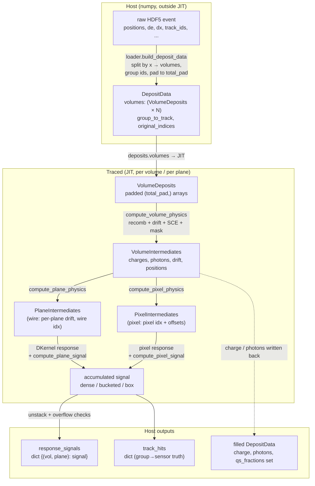

# Data Model

This page is the vocabulary of the codebase: the data types that carry an event
through the simulation, and how they flow from host-side loading, through the
JIT-compiled physics body, to the outputs. Every type here is a `NamedTuple`
defined in [`tools/config.py`](../reference/api/index.md); understanding the
`DepositData → *Intermediates → response_signals` chain is enough to read any
physics module in isolation.

!!! note "Where each type is created"
    - `DepositData` / `VolumeDeposits` — host, in `loader.build_deposit_data`
      (via `load_event`).
    - `VolumeIntermediates` — traced, in `physics.compute_volume_physics`.
    - `PlaneIntermediates` / `PixelIntermediates` — traced, in
      `physics.compute_plane_physics` / `physics.compute_pixel_physics`.
    - Outputs (`response_signals`, `track_hits`, filled `DepositData`) — returned
      by `DetectorSimulator.process_event` after host-side unstacking.

## The flow (D2)



The dashed and solid arrows crossing the `HOST`/`JIT` boundaries are the two
places a shape must be fixed ahead of time: `build_deposit_data` pads every
volume to a constant `total_pad`, and `process_event` stacks the per-volume
arrays before the traced body and unstacks + validates them after.

## `DepositData` — the multi-volume container

```python
class DepositData(NamedTuple):
    volumes: tuple          # (VolumeDeposits_0, ...) — the only field passed to JIT
    group_to_track: Any     # tuple of np.ndarray, one per volume (host only)
    original_indices: Any   # tuple of np.ndarray, one per volume (host only)
```

- **`volumes`** is a tuple of `VolumeDeposits`, one per detector volume. This is
  the only field the traced simulation consumes.
- **`group_to_track`** is host-side numpy: per volume, `group_to_track[g]` maps a
  group id back to its Geant4 track id. Group ids are **1-based** (index `0` is
  reserved/unused). Never touched inside JIT.
- **`original_indices`** records, per volume, which rows of the original event
  each padded deposit came from — used to scatter results back to the input
  ordering on the host.

Deposits are split into volumes by x-position during loading. Groups never span
volumes, so group ids are computed per volume (`loader.compute_group_ids`).

## `VolumeDeposits` — padded per-volume arrays

Every field is a single JAX array of length `total_pad` (positions are
`(total_pad, 3)`); there is no `valid_mask` field.

```python
class VolumeDeposits(NamedTuple):
    positions_mm; de; dx; theta; phi        # geometry + energy
    track_ids; group_ids; t0_us             # labels / timing
    interaction_ids; root_track_ids; pdg    # provenance
    charge; photons; qs_fractions           # zeros on input, filled after sim
    n_actual: int                           # count of real deposits; rest is padding
```

!!! warning "Padding contract"
    Padding rows are set to **`de=0, dx=1, track_ids=-1`** (`dx=1` avoids a
    divide-by-zero in recombination). Nothing masks per-field; instead a single
    mask `jnp.arange(total_pad) < n_actual` is applied **once** to the charges in
    `compute_volume_physics`. From there on, all downstream code trusts that
    padding carries `charge = 0` and therefore contributes nothing.

`charge`, `photons`, and `qs_fractions` are zero on input and are the fields
written back into the returned (filled) `DepositData` after the run.

## `VolumeIntermediates` — per-volume physics results

Produced by `physics.compute_volume_physics` (recombination + drift-to-anode +
SCE corrections + the padding mask):

```python
class VolumeIntermediates(NamedTuple):
    charges; photons                 # zeroed for padding (mask already applied)
    drift_distance_cm; drift_time_us # drift to the anode (local frame)
    positions_cm; positions_yz_cm    # 3D (for NN response) + projected (for wires)
    t0_us; interaction_ids; root_track_ids
```

This is the shared hand-off point: both the wire and pixel branches, and both
the production and differentiable execution paths, consume the same
`VolumeIntermediates`.

## `PlaneIntermediates` / `PixelIntermediates` — per-readout results

For **wire** readout, `physics.compute_plane_physics` runs once per plane
(the `for plane_idx in range(n_planes)` loop is Python, unrolled into the traced
graph). It applies the per-plane drift correction, lifetime attenuation, the
readout-window cut, and wire projection:

```python
class PlaneIntermediates(NamedTuple):
    drift_distance_cm; drift_time_us; tick_us  # tick = drift + t0 + pre_window
    attenuation
    closest_wire_idx; closest_wire_dist        # wire projection
    charges                                    # zeroed outside the readout window
    photons; positions_cm
```

For **pixel** readout, `physics.compute_pixel_physics` produces the analogous
`PixelIntermediates`, replacing wire index/distance with
`pixel_y_idx`/`pixel_z_idx` plus fractional `pixel_y_offset`/`pixel_z_offset`.

Charges are zeroed a second time here for deposits whose readout tick falls
outside the window — the same "trust `charge = 0`" pattern as the padding mask.

## Outputs

`DetectorSimulator.process_event(deposits, key=...)` returns a 3-tuple:

1. **`response_signals`** — a dict keyed by `(vol_idx, plane_idx)`. The internal
   value is dense, bucketed, or wire-sparse depending on `output_format`;
   `sim.to_dense(...)` / `sim.to_sparse(...)` convert any of them. The canonical
   sparse form (from `output.to_sparse`) is:

   ```python
   {(vol, plane): {'wire': int32, 'time': int32, 'values': float32}}
   ```

   (pixel volumes use `pixel_y` / `pixel_z` instead of `wire`.)
2. **`track_hits`** — per-group sensor-truth decomposition used to attribute
   sensor signal back to tracks (see [track hits](../truth/track-hits.md)).
3. **filled `DepositData`** — the input with `charge`, `photons`, and
   `qs_fractions` populated.

Host-side overflow checks (capacity limits on `max_keys`, `maxg`, buckets) run
after the traced body during the unstack; see
[capacities](../concepts/capacities.md).

!!! note "Units of the values"
    Wire `values` are **ENC** before digitization and **ADC** after; pixel
    `values` are **ADC** (chip gain is baked into the kernel). This wire/pixel
    split is intentional — see [units](../physics/units.md).
