# Pipeline Overview

This page walks the full detector-response chain in words, anchored by the D1
data-flow diagram. It runs left to right, from energy deposits to a digitized
sensor readout, and links each stage to its physics deep-dive. The same shared
physics body ([`tools/physics.py`](../reference/api/index.md)) drives both the
production and differentiable [execution paths](execution-paths.md) — the stages
below are identical; only how they are batched differs.

## The pipeline (D1)

```mermaid
flowchart LR
  A["dE, dx, theta, phi<br/>(DepositData)"] --> B["Recombination<br/><i>recombination.py</i>"]
  B -->|"Q (e-), L (photons)"| C["Drift + SCE<br/><i>drift.py / efield_distortions.py</i>"]
  C -->|"drift time, distance"| D["Per-plane correction<br/>+ lifetime attenuation<br/><i>physics.compute_plane_physics</i>"]
  D --> E["Wire / pixel projection<br/><i>wires.py</i>"]
  E --> F["DKernel response<br/>(s = d/max_drift interp)<br/><i>kernels.py</i>"]
  F -->|"x electrons -> ENC"| G["Accumulate<br/>dense / bucketed / box<br/><i>physics.compute_plane_signal</i>"]

  subgraph WIRE["Wire post-processing"]
    direction LR
    G --> H["Electronics (RC(x)RC)<br/><i>electronics.py</i>"]
    H --> I["Noise: intrinsic + coherent<br/><i>noise.py / coherent_noise.py</i>"]
    I -->|"digitize -> ADC"| J["Digitize<br/><i>electronics.py</i>"]
  end
  J --> K["sensor (wire)<br/>ADC, 12-bit"]

  G -. "pixel: single pass, gain baked in,<br/>skips electronics/noise/digitize" .-> L["sensor (pixel)<br/>ADC"]

  classDef units fill:#eef,stroke:#88a;
  class F,J units;
```

The two shaded nodes mark the **units transitions**: the response kernel is a
dimensionless field-impulse contribution, so `kernel × electrons` yields **ENC**
(electrons); digitization turns shaped ENC into **ADC**. Pixel readout takes the
dotted branch and skips the entire bracketed wire post-processing chain.

## Stage by stage

### 1. Recombination — `dE, dx → Q, L`

Each energy deposit becomes ionization electrons `Q` and scintillation photons
`L`. Two models are available (`modified_box` and the angular-aware `emb`),
selected via `SimParams.recomb_params`. Padding deposits (`de = 0`) produce zero
charge, and the single `n_actual` mask is applied here in
`compute_volume_physics`.
→ [recombination](../physics/recombination.md)

### 2. Drift + SCE — `Q → drift time, distance`

Charge drifts to the anode in the volume-local frame (anode at `x = 0`, drift
toward `−x`). Optional space-charge corrections adjust the drift **time** (the
primary SCE quantity; distance is derived from it) and apply a transverse `y,z`
displacement.
→ [drift & diffusion](../physics/drift-diffusion.md) ·
[SCE](../physics/sce.md)

### 3. Per-plane correction + attenuation

For wire readout this runs once per plane (`compute_plane_physics`), subtracting
the plane's offset from the anode drift and applying lifetime attenuation
`exp(−t_drift / lifetime)`. It also computes the readout **tick** (`drift + t0 +
pre_window`) and zeros the charge for any deposit whose tick falls outside the
readout window.
→ [drift & diffusion](../physics/drift-diffusion.md)

### 4. Wire / pixel projection — `wires.py`

The projected `(y, z)` position is mapped to the closest wire index and distance
for each plane's angle and spacing (wire), or to a center pixel index plus a
fractional offset (pixel).
→ [wire vs pixel](../detector/wire-vs-pixel.md)

### 5. Response — DKernel with s-level interpolation

Diffusion broadens each deposit's footprint by an amount that grows with drift
distance. This is captured by a **DKernel** table indexed by a normalized
diffusion level `s = drift_distance / max_drift`. The table is built by
reflect-padding a base kernel and applying a **separable Gaussian convolution**
at each `s` level (`kernels.generate_dkernel_table`); at runtime the kernel is
interpolated at each deposit's `s` and multiplied by its electron count.

!!! note "Not a DCT"
    Despite older wording elsewhere, the DKernel table is built by reflect-pad +
    separable Gaussian convolution (`lax.conv_general_dilated`) — there is no
    discrete cosine transform anywhere in this path.

→ [response kernels](../physics/response-kernels.md)

### 6. Accumulate — dense / bucketed / box

The per-deposit response contributions are scatter-added into the plane's output
via a bounded-memory `fori_loop` (`compute_plane_signal`). The layout depends on
mode: **dense** `(num_wires, num_time)`, memory-saving **bucketed** sparse
buckets, or the group-as-bucket **box** path used by track-hit truth. Capacities
(`max_keys`, `maxg`, buckets) are checked on the host after the traced body.
→ [capacities](../concepts/capacities.md)

### 7. Wire post-processing — `[electronics → noise → digitize]`

For wire readout only, the accumulated ENC signal passes through:

- **Electronics**: an RC⊗RC impulse response applied via sparse FFT on active
  wires (`electronics.py`).
- **Noise**: intrinsic (per-wire ENC, empirically shaped) and optional coherent
  (per-group, anti-correlated) contributions.
- **Digitize**: quantization to 12-bit **ADC** with per-plane pedestals.

→ [electronics & noise](../physics/electronics-noise.md)

### 8. Sensor output

The result is a per-plane sensor readout — wire in **ADC** after digitization,
pixel in **ADC** directly. See the output types in the
[data model](data-model.md).

## The units transition

The kernel values are a **dimensionless** field-impulse fraction, so multiplying
by a deposit's electron count produces **ENC** (electrons). The wire chain shapes
that ENC and then digitizes it into **ADC**. Pixel readout bakes the chip gain
into its kernel, so its accumulated signal is already in ADC — which is why it
needs no separate digitize step.
→ [units](../physics/units.md)

!!! warning "Pixel skips the post-chain"
    The pixel branch is a **single response pass**: it produces both the sensor
    signal and the per-group truth from one accumulation, and it **does not**
    apply electronics, noise, or a separate digitize step. Do not assume the wire
    and pixel signals share units or a post-processing chain — they do not, by
    design.
