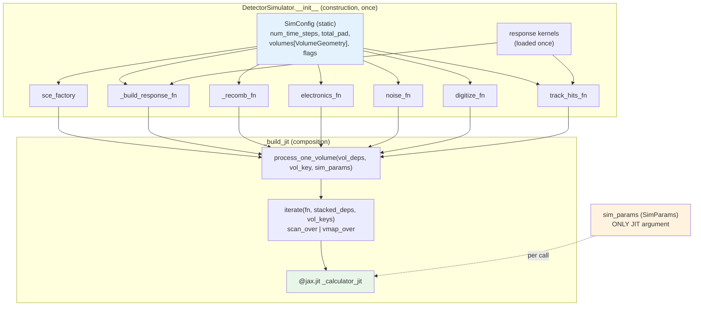

# DetectorSimulator construction

`DetectorSimulator.__init__` (`tools/simulation.py`) is a **closure factory**. It
does every piece of one-time, data-independent setup — loading kernels, sizing
boxes, building per-concern physics closures — and freezes the results into a
single JIT-compiled function. The payoff: the compiled body is small and
uniform, and per-event calls only pass tunable physics values.

This page explains that pattern, why the loops are unrolled at trace time, the
two volume-iteration modes, and what is captured statically versus passed as the
JIT argument.

---

## The factory / closure pattern

Construction proceeds in layers, each closing over the static config built by the
layer before it:

1. **`create_sim_config`** produces the static `SimConfig` (`self._sim_config`),
   including the tuple of per-volume `VolumeGeometry`. This object is captured by
   every closure below and never crosses the JIT boundary as an argument.
2. **Kernels load once** (`load_response_kernels` / `load_pixel_response_kernel`)
   and are shared across all volumes.
3. **`compute_box_dims`** sizes the group-as-bucket track-hits arrays from the
   group definition + geometry + kernel window, and freezes them into
   `cfg.track_hits`.
4. **Per-concern factories** build the physics closures:
    - `_setup_shared_factories` → the SCE, response, and recombination closures
      (`sce_factory`, `_build_response_fn`, `_build_response_fn_diff`,
      `_recomb_fn`).
    - `create_electronics_fn_for_volume`, `create_noise_fn_for_volume`,
      `create_digitize_fn_for_volume`, `create_track_hits_fn_for_volume`.
5. **`_build_jit`** composes all of the above into
   `process_one_volume(vol_deps, vol_key, sim_params)`, wraps it in
   `iterate(fn, …)`, and `@jax.jit`-decorates the result as `_calculator_jit`.

!!! note "Factory closures have mode-dependent signatures"
    The `create_*_fn_for_volume` factories return closures whose behavior — and
    sometimes whose returned tuple shape — depends on the enabled modes
    (dense/bucketed/wire-sparse, wire/pixel, electronics on/off). For example,
    when electronics is disabled `create_electronics_fn_for_volume` returns an
    identity pass-through. These branches are resolved **at construction**, so
    the traced graph sees one fixed variant. This is why the physics pages
    document the behavior in prose — the signatures are not discoverable by
    introspection.

---

## Why the loops are unrolled at trace time

Inside `process_one_volume` (wire path) the plane loop is plain Python:

```python
for plane_idx in range(n_planes):
    plane_type = _PLANE_LABELS[plane_idx]
    plane_int = compute_plane_physics(vol_int, sim_params, vol_geom, plane_idx, ...)
    response_fn = _build_response_fn(sim_params, plane_type)
    ...
```

This loop executes **once, during JAX tracing**, and emits a fully unrolled
graph: one straight-line copy of the per-plane physics per plane. The benefit is
that `plane_idx` is a concrete Python `int` inside the trace, so it can index
into static tuples that hold per-plane geometry:

```python
vol_geom.wire_spacings_cm[plane_idx]   # tuple index — needs a static int
vol_geom.angles_rad[plane_idx]
kernels[plane_type]                    # dict lookup by static key
```

If the plane axis were a traced loop (`scan`/`fori_loop`) these static lookups
would be illegal. Unrolling trades a slightly larger graph for the ability to
capture per-plane static config directly. There are only a handful of planes, so
the graph stays small.

The **volume axis** is different: it is mapped by `scan`/`vmap`, so all volumes
must present uniform array shapes. That is exactly why the loader transforms
every volume into the same **local frame** (anode at `x=0`, `yz` centered) — one
compiled body then handles any number of volumes. See
[coordinates](../concepts/coordinates.md).

---

## Volume iteration: scan vs vmap

The `iterate_mode` constructor argument selects how `process_one_volume` is
mapped over the stacked volume axis:

```python
self._iterate = scan_over if iterate_mode == 'scan' else vmap_over
```

| Mode | Helper | Semantics | When |
|---|---|---|---|
| `'scan'` (default) | `scan_over` (`jax.lax.scan`) | Volumes processed **sequentially**; peak memory is one volume's worth. | Default for all production; safe for many/large volumes (e.g. ND-LAr's 70). |
| `'vmap'` | `vmap_over` (`jax.vmap`) | Volumes processed **in parallel** (batched). | A real, supported alternate mode; rarely used. Higher peak memory since all volumes are live at once. |

Both helpers take the same `fn` and stacked inputs, so switching modes changes
no physics — only the memory/parallelism trade-off.

!!! note "Empty volumes"
    Because volumes are padded to a fixed `total_pad` and padding deposits have
    `de=0` (masked to `charges=0` in `compute_volume_physics`), a volume with no
    real deposits flows through the body producing all-zero signal at no
    correctness cost. The mask in `compute_volume_physics` is the single point
    that guarantees this — there is no separate `lax.cond` short-circuit in the
    current code; the padding mask alone makes empty and partially-filled volumes
    correct. (`process_event` also uses the traced `n_actual` to bound the
    accumulation `fori_loop`, so trailing empty chunks add nothing.)

---

## Static (`SimConfig`) vs dynamic (`SimParams`)

The construction/call split maps exactly onto two NamedTuples:

| | `SimConfig` | `SimParams` |
|---|---|---|
| **Role** | Static structure | Tunable physics |
| **Captured / passed** | Closure-captured at `__init__` | The **only** JIT argument |
| **Contents** | `num_time_steps`, `total_pad`, `response_chunk_size`, mode flags, per-volume `VolumeGeometry`, `plane_names`, `output_format`, `track_hits` | `velocity_cm_us`, `lifetime_us`, `diffusion_trans_cm2_us`, `diffusion_long_cm2_us`, `recomb_params` |
| **Changing it** | Requires a new closure → **JIT recompile** | Free — **no recompile** |

Because `SimParams` is the sole traced argument, you can sweep velocity,
lifetime, diffusion, or recombination values across events without recompiling.
Changing anything structural (a mode flag, `total_pad`, geometry) means building
a new `DetectorSimulator`. See [config vs params](config-vs-params.md).

---

## D3 — Closure / factory structure



The static `SimConfig` (blue) feeds all N factory closures; `_build_jit` composes
them into `process_one_volume`; `iterate` maps that over the volume axis; and
`sim_params` (orange) is the single argument that enters the compiled function at
call time.

---

## See also

- [Reading guide](reading-guide.md) — the full call chain in execution order.
- [Execution paths](execution-paths.md) — how `forward` reuses these closures.
- [Config vs params](config-vs-params.md) — the static/dynamic split in detail.
- [Capacities](../concepts/capacities.md) — `total_pad`, box dims, and overflow.
