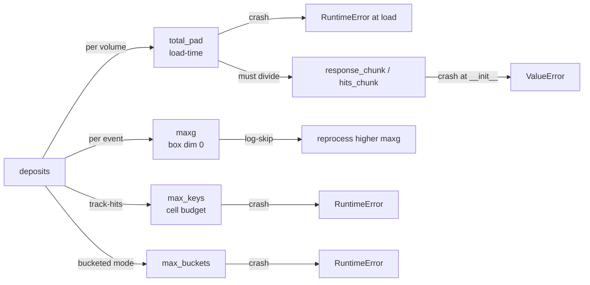

# Capacities & overflow

The production simulator compiles **once** for fixed array shapes (see
[padding & masking](padding-masking.md)), so every buffer it allocates has a
statically sized capacity. Those capacities must be large enough for the data —
if an event exceeds one, the behavior ranges from a hard crash to a silent
truncation depending on *which* capacity overflowed. This page is the reference
for every capacity, the array it bounds, and its overflow path. Sizing them is
the [profiler](../production/profiler.md)'s job; this page explains what it is
sizing and why the failure modes differ.

!!! tip "Just want it sized correctly?"
    Run `python3 -m profiler.setup_production --data <run_dir/> --config
    <detector.yaml> -o <production.yaml>` and pass the result via
    `--production-config`. The rest of this page is for understanding the
    overflow errors and the memory/mode trade-offs.

## Capacity map (D5)

Each capacity bounds one array dimension, and each has a distinct overflow path:
**crash** (hard `RuntimeError`, event fails), **log-skip** (raise on host,
caught by `run_batch`, event logged and reprocessed), or **truncate** (result
is clipped and a warning is logged).

| Capacity | Bounds | Where checked | Overflow path |
|---|---|---|---|
| `total_pad` | deposits per volume (leading array dim) | `tools/loader.py` (load time) | **crash** — `RuntimeError` at load |
| `maxg` / `maxg_medium` | groups per event (box first dim) | `process_event` host check | **log-skip** — `RuntimeError`, reprocess at higher `maxg` |
| `max_keys` | track-hits box-cell budget | `process_event` host check | **crash** — `RuntimeError` (count still correct) |
| `max_buckets` | active buckets (bucketed mode only) | `process_event` host check | **crash** — `RuntimeError` |
| `response_chunk` / `hits_chunk` | `fori_loop` chunk size | simulator `__init__` | **crash at construction** — must divide `total_pad` |
| box dims (`box_bpy/bpz/bt`, `box_bw/btw`) | per-group footprint tile | derived analytically | no runtime overflow (bounded by grouping rule) |



## The capacities

### `total_pad` — deposits per volume

The fixed length every per-volume deposit array is padded to. Bounds the leading
dimension of `positions_mm (total_pad, 3)`, `de`, `dx`, `charges`, etc. Checked
in the loader when splitting deposits into volumes.

!!! danger "Overflow: hard crash at load"
    ```text
    Volume 0 has 512,340 deposits > total_pad (450,000).
    Increase --total-pad or run profiler.setup_production.
    ```
    The event never reaches the GPU. Sized to the max deposit count over the
    dataset (or p99.9 with `--use-p999`).

### `maxg` / `maxg_medium` — groups per event

Deposits are grouped into short runs per track (see
[track-hits](../truth/track-hits.md)). In the default **box** track-hits path,
the box is indexed by `group_id` along its first dimension, so `maxg` bounds the
number of groups per event. A `group_id ≥ maxg` would be silently clipped and
corrupt the result, so it is detected on the host (group ids are known right
after load) and raised.

`maxg_medium` is the medium-tier value for tiered routing (`run_batch` picks the
medium or high simulator per event by exact group count); it bounds the same
array, just for the smaller-capacity simulator.

!!! warning "Overflow: log & reprocess"
    ```text
    maxg overflow vol 0: n_groups=118,204 >= maxg=110,000.
    Increase --maxg or run profiler.setup_production.
    ```
    `run_batch` catches this, logs it as `maxg_overflow`, **skips** the event,
    and it is reprocessed at a higher `maxg`. `maxg` is sized generously
    (p99.95 of the group distribution) precisely so only a rare tail hits this
    and pays the reprocess cost.

### `max_keys` — track-hits box-cell budget

The number of distinct box cells whose accumulated `|signal| > inter_thresh`
across the whole event (the storage budget for non-zero track-hit entries).
Checked on the host against the reported cell count.

!!! danger "Overflow: crash (count is correct, storage truncates)"
    ```text
    track_hits overflow vol 0 plane 2: count=9,412,880 >= max_keys=9,000,000.
    Increase --max-keys or run profiler.setup_production.
    ```
    The reported `count` is the true number of cells, so it tells you exactly
    how high to set `max_keys`. The stored keys truncate; the sim raises so you
    don't ship a truncated result.

`max_keys` is the trickiest capacity because it depends on charge, not just
geometry. The profiler estimates it **without simulating** every event: per
deposit it counts the response-kernel cells that clear the *absolute*
`inter_thresh` given that deposit's intensity (recombination × drift
attenuation), then sums (`profiler/estimate_max_keys.py`). A naive
charge-independent geometry count under-counts ~3× because it ignores deposit
brightness. The per-deposit sum over-counts the within-group overlap, corrected
by a per-readout knob calibrated with `compare_max_keys`:

| Readout | Knob | Why |
|---|---|---|
| **pixel** | `c* = 2.5` (threshold ×) | overlap lives in the kernel tails — a higher threshold removes it |
| **wire** | `÷ 3.79` (flat factor) | overlap is structural (1-D projection × 3 planes) — a flat factor |

### `response_chunk` / `hits_chunk` — chunk sizes

The `fori_loop` batch sizes for sensor accumulation and track-hits
respectively. These are speed knobs (bigger = fewer loop steps, more memory per
step), **not** capacities in the overflow sense — but each **must divide
`total_pad` evenly**, checked at simulator construction.

!!! warning "Overflow: crash at construction"
    ```text
    total_pad (450,000) must be divisible by response_chunk_size (50,000).
    total_pad (450,000) must be divisible by hits_chunk_size (25,000).
    ```
    A `ValueError` before any event runs. See
    [padding & masking → chunk divisibility](padding-masking.md#chunk-divisibility).

### `max_buckets` — active buckets (bucketed mode)

Only used by the bucketed accumulation mode (below). Bounds the number of active
sparse buckets `(max_buckets, B1, B2)`. Checked on the host after the sim.

!!! danger "Overflow: crash"
    ```text
    Bucket overflow vol 0 plane 2: num_active=1,024 >= max_active_buckets=1,000.
    Increase --max-buckets.
    ```
    Unused for pixel readout (`max_buckets` in the config is a no-op there).

### Box dims — analytic, not scanned

The per-group footprint tile (`box_bpy/box_bpz/box_bt` for pixel;
`box_bw/box_btw` for wire) that the box path allocates per group. These are
**derived analytically** by `compute_box_dims` (`tools/track_hits.py`), not
scanned from data: a group is at most `group_size` consecutive deposits of one
track, split whenever the inter-deposit gap exceeds `gap_threshold_mm`. So a
group's span along any axis is bounded by
`span = (group_size − 1) × gap_threshold_mm` — a hard maximum set by the
grouping rule. Projected through the readout pitch and drift velocity, plus the
response-kernel window, this bounds the box exactly. Because the bound is
structural, there is **no runtime box-dim overflow**. Left as `None` in the
config, the simulator fills them in via `compute_box_dims`.

## How the profiler sizes them

`profiler/setup_production.py` sizes the whole set in one orchestrated run:

1. **Combined scan (CPU)** → `total_pad` (max deposit count), `maxg` (p99.95 of
   the group distribution), box dims (analytic), and the charge-aware
   `max_keys` estimate.
2. **Chunk optimization (GPU)** → `response_chunk`, `hits_chunk` (timed, kept
   divisible).
3. **`maxg` benchmark (GPU)** → `maxg_medium` for tiered routing.
4. **Threshold analysis (GPU, optional)** → `corr_threshold`, `threshold_adc`.

See [profiler](../production/profiler.md) for the per-script breakdown and
`compare_max_keys` for validating/calibrating the `max_keys` estimate on your
data's tail.

## Thresholds differ by readout

Two of the config values here are thresholds whose **units depend on the
readout**, which is a common source of confusion:

- `inter_thresh` (the in-JIT box-cell cutoff that drives `max_keys`) and
  `corr_threshold` (the hits CSR cutoff) are in **ENC (electrons)** for wire but
  **ADC** for pixel.
- `threshold_adc` (the sparse sensor cutoff) is **ADC** for both.

This is by design — see [units](../physics/units.md) for the full table. It
matters here because `inter_thresh` sets the `max_keys` budget: the same numeric
value means different physical cuts on wire vs pixel.

## Bucketed accumulation mode (memory-saving alternative)

By default, wire sensor accumulation scatter-adds each response kernel into a
**dense** `(num_wires, num_time_steps)` array per plane. For very large events
that dense array dominates memory. **Bucketed mode** (`use_bucketed=True`, or
`--bucketed` on `run_batch`) instead scatters contributions into a sparse set of
small tiles `(max_buckets, B1, B2)` keyed by `(wire, time)` region
(`compute_plane_signal_bucketed` / `compute_bucket_maps` in `tools/physics.py`),
trading a fixed dense allocation for a bounded sparse one. This is the capacity
`max_buckets` bounds.

Notes and constraints:

- **Wire-only.** Bucketed mode is a wire-readout memory-saver. It is *not*
  required for pixel, and coherent noise is incompatible with it (dense output
  is required for coherent noise — the constructor raises if both are set).
- **Pixel uses the box path by default** for track-hits regardless, and the
  pixel sensor path does not need bucketing (`max_buckets` is inert for pixel).
  A complete *pixel* bucketed analog exists in the code
  (`compute_pixel_bucket_maps` / `compute_pixel_signal_bucketed`) but is not
  wired into the pixel dispatch — it is kept as a reference implementation.
- Output is a `bucketed` 5-tuple `(buckets, num_active, compact_to_key, B1, B2)`
  that `tools/output.py` decodes back to dense or sparse.

See the [profiler](../production/profiler.md) for probing `max_buckets` and
[plotting](../viz/plotting.md) for bucket visualization.
